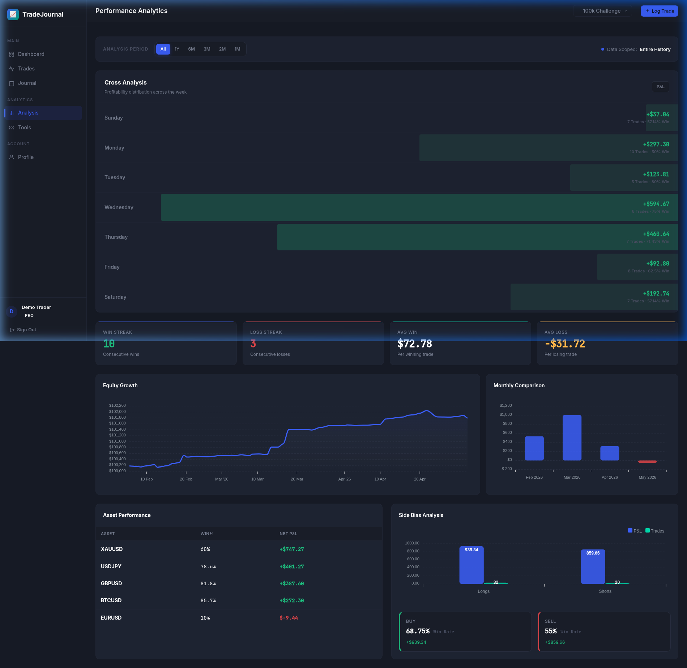
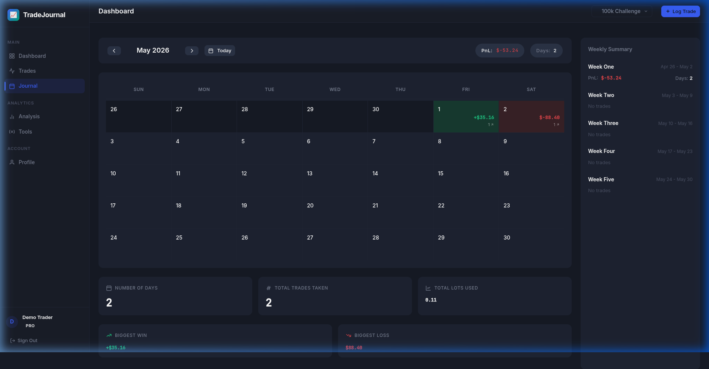

# 📊 TradeJournal: The Ultimate Multi-Account Trading Suite

**TradeJournal** is a professional, high-performance trading companion designed for modern traders. Built with a focus on speed, analytics, and precision, it empowers you to manage multiple trading accounts, track performance with deep analytics, and master risk management with an integrated suite of calculators.

<p align="center">
  
</p>

---

## 🚀 Key Features

### 📈 Advanced Analytics & Cross Analysis
- **Timeframe Filtering**: Analyze your performance over 1m, 3m, 6m, or 1y with a single click.
- **Day of the Week (Cross Analysis)**: Identify your most profitable trading days with a high-visual heatmap.
- **Equity Curve & Performance Tracking**: Visualize your growth with dynamic charts and real-time P&L tracking.
- **Deep Metrics**: Monitor Win Rate, Profit Factor, Expectancy, and Average R:R at a glance.

### 📅 Visual Trade Journal
- **Calendar Heatmap**: A professional trading calendar to visualize your winning and losing days at a glance.
- **Weekly Summaries**: Automated weekly P&L and trade count breakdowns.
- **Recent Trades**: Quick access to your latest setups and notes.

<p align="center">
  
</p>

### 💼 Multi-Account Architecture
- **Isolated Journals**: Manage different strategies or prop firm accounts independently within a single interface.
- **Capital Management**: Track independent balances and performance history for each account.

### 🧮 Professional Trading Tools
- **Advanced Position Sizer**: Calculate optimal lot sizes with a unique **Pips / Price toggle** (optimized for Gold, Forex, Indices, and Crypto).
- **Risk:Reward Calculator**: Instantly verify your trade setups to ensure you're maintaining a healthy edge.
- **Profit/Loss Simulator**: Forecast your earnings by entering pip targets or specific price levels.
- **Drawdown Recovery Tool**: Calculate the exact gain needed to recover from any losing streak.

---

## 🛠️ Tech Stack
- **Backend**: Laravel 11 (PHP)
- **Frontend**: Blade, Alpine.js, TailwindCSS
- **Charts**: ApexCharts.js
- **Database**: SQLite / MySQL
- **Real-time Stats**: Custom Caching Engine for instant analytics

---

## 🚦 Installation & Setup Guide

### 🐧 Linux (Ubuntu/Debian)
```bash
# Update system
sudo apt update && sudo apt upgrade -y

# Install PHP 8.2+ and extensions
sudo apt install -y php8.2 php8.2-curl php8.2-xml php8.2-zip php8.2-sqlite3 php8.2-mbstring

# Install Composer
curl -sS https://getcomposer.org/installer | php
sudo mv composer.phar /usr/local/bin/composer

# Install Node.js & NPM
curl -fsSL https://deb.nodesource.com/setup_18.x | sudo -E bash -
sudo apt install -y nodejs

# Setup Project
git clone https://github.com/ASHLIN-BIJU/Trading-Journal.git
cd Trading-Journal
composer install
npm install
cp .env.example .env
php artisan key:generate
touch database/database.sqlite
php artisan migrate
npm run build
php artisan serve
```

---

## 🧪 Demo Data (Optional)
If you want to test the application with sample data (like in the screenshots), run:
```bash
php artisan migrate:fresh --seed
```
*Note: This will create a demo user: `demo@tradejournal.com` with password `password`.*

---

## 🖥️ Linux Desktop App (One-Click Startup)
For a native app experience on Linux, you can use the built-in launcher:
1. Make the launcher executable:
   ```bash
   chmod +x launch.sh
   ```
2. Create a desktop shortcut (optional):
   - You can copy the provided `Trading-Journal.desktop` (template) to your desktop.
   - Update the `Exec` and `Icon` paths to point to your project folder.
   - Right-click the icon and select **"Allow Launching"**.

---

Developed with ❤️ by [Ashlin Biju](https://github.com/ASHLIN-BIJU).
